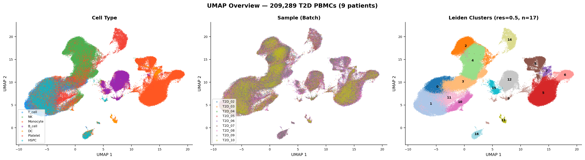
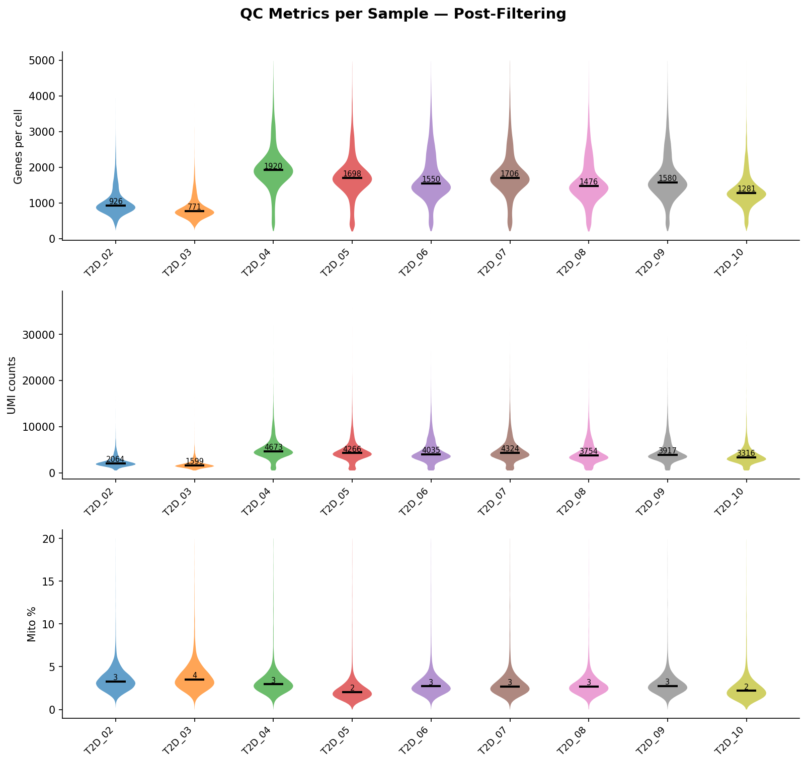
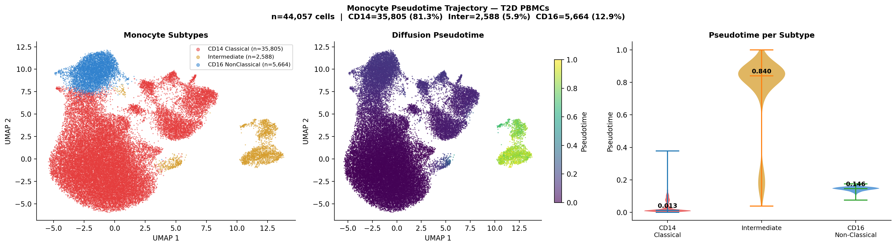
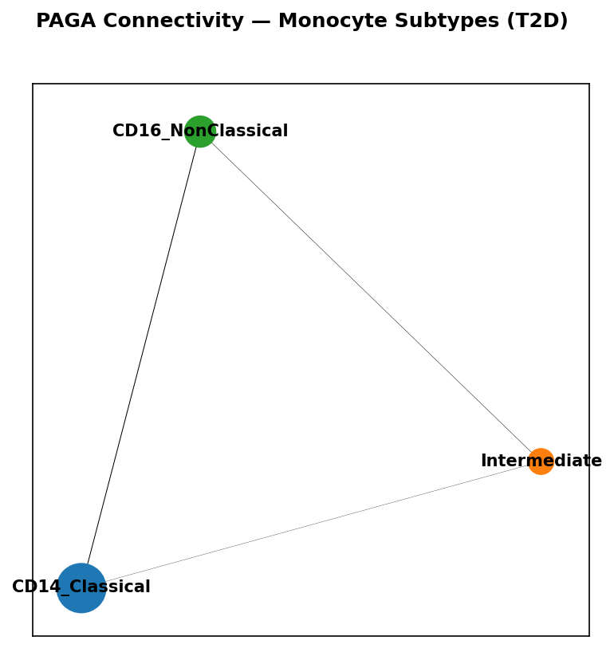
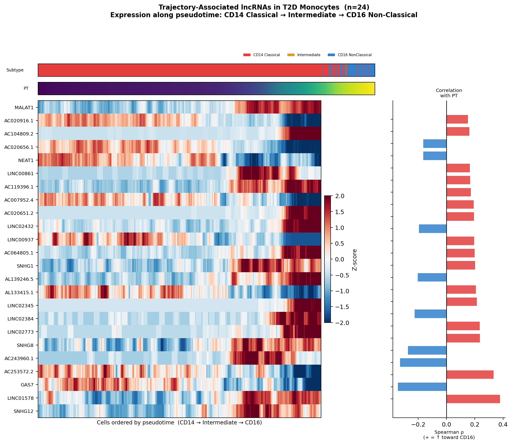
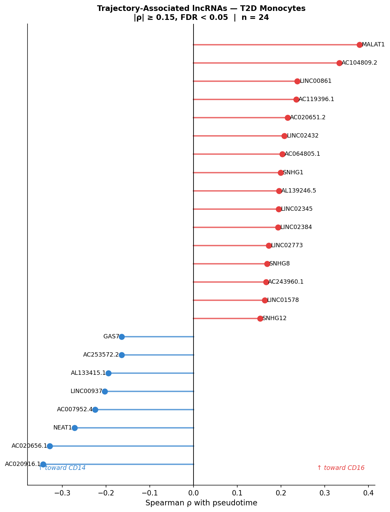
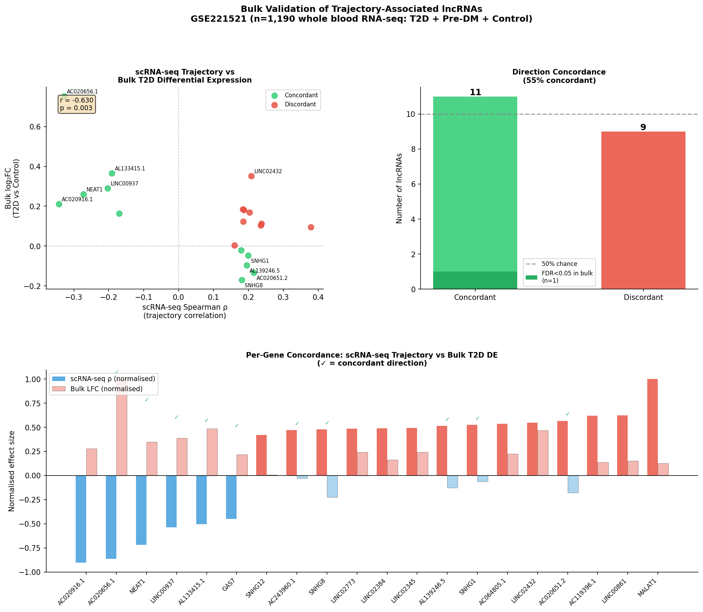
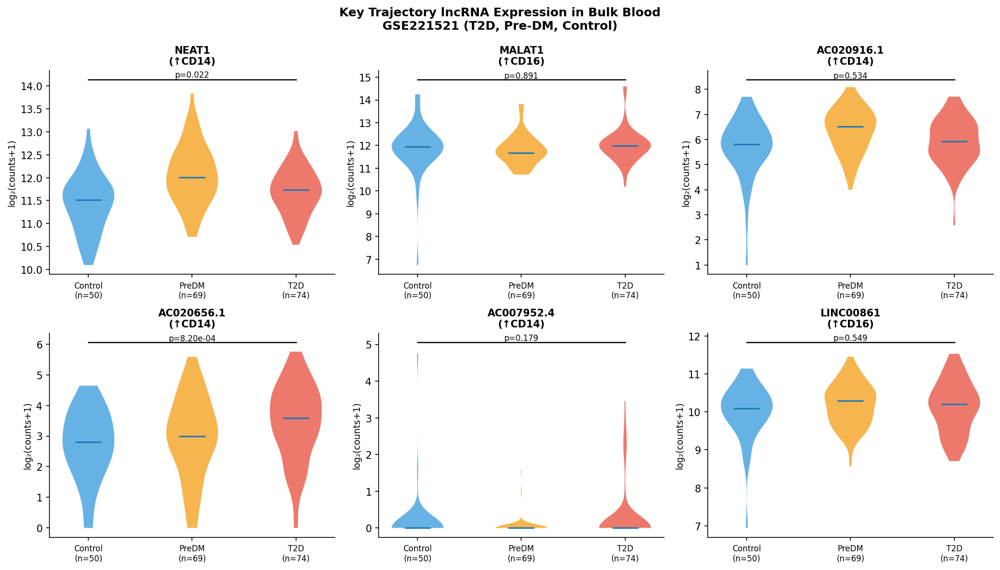
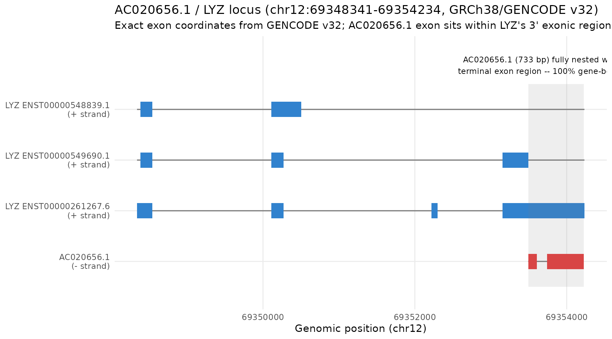

# Donor-Aware Single-Cell Analysis Identifies AC020656.1, a Locus Antisense to LYZ, as a Candidate Monocyte-State and Type 2 Diabetes-Associated Transcript

**Usama Manzoor**
JSMU Diagnostic Laboratory & Blood Bank, Jinnah Sindh Medical University, Karachi, Pakistan
Corresponding author: usama.manzoor1121@gmail.com

*[Author contributions, funding, and ethics statements: see end of document — marked for author completion where information was not available for this revision.]*

---

## Abstract

**Background.** Long non-coding RNAs (lncRNAs) contribute to immune cell identity, but their single-cell dynamics across monocyte states in type 2 diabetes (T2D) have not been characterized with a statistical framework that accounts for the fact that thousands of cells from the same donor are not independent observations.

**Methods.** We reanalyzed the largest publicly available T2D peripheral blood mononuclear cell (PBMC) single-cell RNA-seq dataset (GSE268210; 9 retained donors, 209,289 post-QC cells, 44,057 monocytes) using Scanpy with Harmony batch correction. lncRNAs were identified by direct cross-reference of the dataset's Ensembl gene identifiers against the complete GENCODE v32 annotation, superseding an initial gene-symbol pattern-matching screen (71.5% recall, 98.2% precision against this ground truth). Because cells from one donor are correlated observations, trajectory association between candidate lncRNA expression and diffusion pseudotime was tested with a donor-aware statistic: per-donor Spearman correlations combined by a DerSimonian-Laird random-effects meta-analysis with a Hartung-Knapp-Sidik-Jonkman small-sample correction. This framework, and a parallel donor-aware pseudobulk differential-state analysis (edgeR), were independently re-implemented in R using different libraries (`metafor`, `edgeR`, `limma`) as a reproducibility check. Findings were validated in an independent whole-blood bulk RNA-seq cohort (GSE221521; T2D n=74, Pre-DM n=69, Control n=50).

**Results.** Diffusion pseudotime and a graph-based topology analysis (PAGA) showed CD14 Classical and CD16 Non-Classical monocytes are more directly transcriptionally connected to each other than either is to the Intermediate state, arguing against a strictly linear activation continuum. GENCODE cross-reference reclassified 2 of 24 originally-flagged trajectory loci as protein-coding; of the remaining 22 confirmed lncRNAs, 21 remained significant under the donor-aware statistic (donor-aware |ρ| 0.155–0.371, FDR<0.001), and an unbiased donor-aware screen of 481 candidate loci identified 28 significant loci in total, 7 not present in the original screen. **AC020656.1** was the strongest candidate (donor-aware ρ=−0.335, p=2.65×10⁻⁸, identical direction in 9/9 donors, leave-one-donor-out stable), highly specific to CD14 Classical monocytes (45.5% vs. 9.3% vs. 0.5% detection across CD14/CD16/Intermediate, robust across detection thresholds), and independently associated with T2D in bulk blood (log₂FC=+0.75–0.77 across two independent statistical implementations) with a progressive Control→Pre-DM→T2D gradient. However, AC020656.1's entire annotated locus lies completely within the terminal exon of LYZ on the antisense strand. Cell-level analysis showed this locus's correlation with LYZ (ρ=0.12–0.38 within subtypes) is substantially weaker than their pseudobulk correlation (ρ≈0.94–0.98), and AC020656.1's T2D association persisted, attenuated but not eliminated, after adjusting for LYZ expression (30.8% attenuation) or estimated monocyte fraction (15.4% attenuation). No BAM or FASTQ files were available for this reanalysis, so strand-specific read assignment could not be verified, and independent transcription of AC020656.1 as distinct from LYZ-locus activity remains unresolved.

**Conclusions.** A donor-aware statistical framework, cross-validated across two independent software implementations, identifies a reproducible set of monocyte-state-associated lncRNA loci in T2D. AC020656.1 is a robust, externally-corroborated candidate disease-associated locus and blood-accessible biomarker candidate; its complete genomic nesting within LYZ means it should be regarded as a candidate locus rather than a confirmed independently-regulated lncRNA pending strand-resolved validation.

**Keywords:** type 2 diabetes; long non-coding RNA; single-cell RNA sequencing; monocyte; donor-aware statistics; AC020656.1; LYZ; NEAT1; pseudotime; PAGA

---

## 1. Introduction

Type 2 diabetes (T2D) is accompanied by chronic low-grade inflammation with a substantial contribution from innate immune activation [1]. Circulating monocytes are central to this process: classical CD14⁺⁺CD16⁻ monocytes in T2D show heightened pro-inflammatory activation and elevated expression of IL-1β and TNF-α [2,3]. Human blood monocytes are conventionally divided into classical (CD14⁺⁺CD16⁻), intermediate (CD14⁺CD16⁺), and non-classical (CD14ˡᵒCD16⁺⁺) subtypes [4], and their relative abundance and transcriptional state are altered in T2D [5].

Long non-coding RNAs (lncRNAs) — transcripts exceeding 200 nucleotides with limited protein-coding potential — regulate immune cell identity and inflammatory signalling [6,7]. NEAT1 scaffolds nuclear paraspeckles and modulates TLR-driven NF-κB activation [8]; MALAT1 influences monocyte-to-macrophage differentiation through splicing regulation [9]. No prior study has characterized the lncRNA landscape across monocyte states in T2D at single-cell resolution using a statistical model that treats the donor, rather than the cell, as the unit of biological replication — a distinction that matters because a typical single-cell dataset contains many thousands of cells from a handful of donors, and cells from the same donor share genetic background, technical batch, and sample handling.

The largest publicly available T2D PBMC single-cell dataset (GSE268210) contains only T2D-patient samples; the matched healthy-control data from the same study were deposited in CODA, a Korean national controlled-access repository not accessible to international researchers at the time of this analysis [personal communication, D. Gu, June 2026]. We therefore characterize lncRNA dynamics within the T2D monocyte compartment and validate candidate findings in an independent bulk blood cohort spanning Control, Pre-DM, and T2D groups (GSE221521).

This manuscript reports a donor-aware reanalysis of GSE268210, cross-validated by an independent implementation in R, together with a detailed investigation of the strongest candidate locus, AC020656.1, including its unresolved genomic relationship to the neighboring gene LYZ. We report what the data establish, what remains statistically robust but biologically unresolved, and what would be required to resolve it.

## 2. Materials and Methods

### 2.1 Study design and datasets

This is a secondary reanalysis of two previously deposited, publicly available datasets. GSE268210 (Gu et al., 2024 [5]) contains 10x Genomics 5′ v2 single-cell RNA-seq of PBMCs from 10 T2D patients, processed with CellRanger v5.0.1 against GRCh38/GENCODE v32. One sample (GSM8287977) was excluded prior to any statistical analysis because it yielded a divergent feature count (33,538 vs. 36,601 in all other samples), consistent with a different reference or CellRanger configuration; including it would require an outer-join concatenation that fills thousands of genes with zeros in this sample and could bias the batch-corrected embedding. The remaining 9 donors constitute the analytical cohort for all single-cell results reported here. This dataset's underlying sequencing runs are archived at NCBI SRA under BioProject PRJNA1115130 (SRA Study SRP509449) as 30 total runs (10 donors × 3 library types: gene expression, TCR, and BCR); only the 10 gene-expression libraries' deposited, CellRanger-processed feature-barcode matrices — not the raw sequencing reads — were used in this reanalysis (see Section 2.12 and Limitations).

For independent validation, GSE221521 provides whole-blood bulk RNA-seq from 193 subjects: T2D (n=74), Pre-DM (n=69), and Control (n=50).

### 2.2 Single-cell RNA-seq preprocessing and quality control

Count matrices were processed with Scanpy v1.11.5 [10]. Cells were retained if they had 200–5,000 detected genes, ≥500 UMI counts, and ≤20% mitochondrial content. Doublets were removed with `sc.pp.scrublet`. Counts were normalized to 10,000 UMI per cell and log(1+x)-transformed. Batch effects across the 9 donors were corrected with Harmony [11] applied to the top 30 principal components computed from 2,000 highly variable protein-coding genes. Leiden clustering (resolutions 0.3–0.8) and UMAP embedding were computed on the Harmony-corrected neighbor graph. Ambient RNA correction (SoupX) was scripted as part of this pipeline but not executed in the analyzed run; we return to this, and to why it could not be executed retrospectively, in Limitations. After quality control, 209,289 cells were retained across the 9 donors (median 22,706 cells/donor).

### 2.3 Cell-type annotation

Broad PBMC populations were assigned by scoring each cell against canonical marker gene sets (`sc.tl.score_genes`) for T cells (CD3D, CD4/CD8A, IL7R, CCR7/GZMK), NK cells (NCAM1, NKG7, GNLY, KLRF1), monocytes (CD14, LYZ, S100A8/9, FCN1, VCAN; FCGR3A, MS4A7, CDKN1C, LST1), B cells (CD79A/B, MS4A1), dendritic cells (CD1C, FCER1A, LILRA4, CLEC4C), platelets (PPBP, PF4), and HSPCs (CD34, SPINK2), assigning each cell to its highest-scoring category. Seven populations were identified: T cells, NK cells, monocytes, B cells, platelets, dendritic cells, and hematopoietic stem/progenitor cells. This annotation used marker-based scoring only; no independent reference-based cross-check (e.g., SingleR, CellTypist) was performed (see Limitations).

### 2.4 Monocyte subtype definition

Monocytes were re-clustered and subtypes assigned from Leiden clustering (resolution 0.3 on the monocyte subset) using marker expression: CD14 Classical (CD14≥1.1, S100A8≥2.7), CD16 Non-Classical (FCGR3A≥2.6, MS4A7≥2.0, CDKN1C≥2.2), Intermediate (moderate co-expression of CD14 and FCGR3A with elevated HLA-DRA). Clusters with dendritic-cell-like profiles (HLA-DRA>3.5 with monocyte markers <0.1) were excluded as contamination. This yielded 44,057 clean monocytes: CD14 Classical n=35,805 (81.3%), Intermediate n=2,588 (5.9%), CD16 Non-Classical n=5,664 (12.9%), proportions consistent with published flow-cytometry ranges (75–85%, 2–10%, 5–15% respectively [4]).

### 2.5 Trajectory and topology analysis

Diffusion pseudotime was computed with `sc.tl.diffmap` (15 components) and `sc.tl.dpt` (10 diffusion components [12]), rooted at the cell with maximal CD14 expression within the CD14 Classical cluster. To test whether the resulting ordering reflects a linear continuum or a branching structure, we additionally computed Partition-based Graph Abstraction (PAGA [13]) connectivity between the three subtypes on the same Harmony-corrected embedding used for the rest of the analysis.

### 2.6 lncRNA annotation

An initial candidate screen used gene-symbol pattern matching (regular-expression matching against prefixes including `LINC`, `AC`, `AL`, `SNHG`, `NEAT`, `MALAT`, and related patterns) as a fast first pass. This was subsequently and formally corrected: lncRNAs were identified by cross-referencing the dataset's Ensembl gene identifiers (available in the CellRanger `features.tsv` output) against the complete GENCODE v32 annotation GTF (EBI FTP mirror, release dated 2019-09-18), retaining genes with `gene_type == "lncRNA"` (16,849 loci genome-wide; 2,899 detectable — non-zero count in at least one cell — in this dataset). Validated against this ground truth, the pattern-matching screen achieved 71.5% recall and 98.2% precision. All lncRNA-specific results in this manuscript use the GENCODE-confirmed annotation; two loci flagged by the original pattern method (AC119396.1, GAS7) are GENCODE-annotated protein-coding genes and were excluded from every lncRNA-specific analysis.

### 2.7 Donor-aware trajectory-association statistics

Cells from the same donor are not independent observations. For each candidate lncRNA detected in ≥2% of monocytes (481 loci), Spearman correlation between expression and diffusion pseudotime was computed separately within each of the 9 donors. The 9 donor-level correlations were combined via a DerSimonian-Laird random-effects meta-analysis on the Fisher z scale [14], with the between-donor variance component (τ²) estimated from Cochran's Q, and a Hartung-Knapp-Sidik-Jonkman correction [15] applied to the combined test statistic (t-distribution, 8 degrees of freedom), which is standard practice for random-effects meta-analysis with a small number of units. A locus was called significant at combined |ρ|≥0.15, Benjamini-Hochberg FDR<0.05 (across all 481 tested loci), and direction agreement in at least 6 of 9 donors. This procedure directly replaced a preliminary cell-pooled Spearman correlation (all monocytes pooled across donors, ignoring donor identity), which produced p-values that numerically underflowed to zero even at modest effect sizes (|ρ|≈0.2–0.4) — a diagnostic signature of pseudoreplication, since a true 9-unit effect of this magnitude cannot produce p-values below machine precision.

### 2.8 Donor-aware pseudobulk differential-state analysis

As an independent, categorical complement to the continuous pseudotime-correlation framework, donor×subtype pseudobulk profiles were constructed by summing raw UMI counts within each of the 27 donor-by-subtype combinations (9 donors × 3 subtypes; every combination had ≥10 contributing cells). Differential expression between subtypes was tested with edgeR [16] using a paired generalized linear model (`~donor + subtype`), which models donor as a blocking factor and is therefore donor-aware by construction.

### 2.9 Bulk RNA-seq validation

From GSE221521, count columns were extracted from the supplementary count table (gene symbols taken from its `gene_name` annotation column). Differential expression (T2D vs. Control, Pre-DM vs. Control, T2D vs. Pre-DM) was assessed with two independent implementations: (i) Welch's t-test on log₂(counts+1) with Benjamini-Hochberg correction, applied to a pre-specified panel of the 20 trajectory candidates detectable in bulk data; and (ii) an independent limma-voom [17,18] analysis of all 18,047 genes passing expression filtering, in R, as a reproducibility check. Because these are independent patient samples, no donor-aware correction is required at this stage. Pearson correlation between donor-aware scRNA-seq ρ and bulk log₂FC was computed across GENCODE-confirmed lncRNAs detectable in both datasets, and a one-sided binomial test (vs. 50% chance) assessed whether the categorical direction-concordance rate exceeded chance.

### 2.10 Cell-composition sensitivity analysis

Because GSE221521 profiles whole leukocytes rather than purified monocytes, we assessed whether candidate associations could be explained by shifts in blood cell composition using two complementary approaches: (i) a marker-based, approximate cell-fraction estimate obtained by non-negative least squares (NNLS) regression of each bulk sample's expression against a signature matrix of mean marker-gene expression per cell type derived from this study's own single-cell data (not a validated external deconvolution method such as CIBERSORTx, which was not available in this offline reanalysis), followed by comparison of the disease-association coefficient before and after adjusting for the estimated monocyte fraction; and (ii) a direct linear model adjusting AC020656.1's bulk expression for LYZ's own bulk expression level (`AC020656.1 ~ condition + LYZ`).

### 2.11 AC020656.1–LYZ locus investigation

Following identification of AC020656.1 as the leading candidate, we determined that its GENCODE v32 annotation places it entirely within the genomic span of the neighboring gene LYZ, on the opposite strand. We therefore performed a dedicated investigation using only already-available processed data and public metadata (no new sequencing data were generated or downloaded): (i) exact coordinate-level quantification of the gene-body and exon-level overlap using the GENCODE v32 GTF; (ii) confirmation, via direct inspection of each sample's CellRanger `features.tsv` feature reference, that AC020656.1 (Ensembl ID ENSG00000257764) and LYZ (ENSG00000090382) are independently tracked features with distinct gene identifiers; (iii) comparison of AC020656.1–LYZ correlation at the pseudobulk (donor×subtype) level versus the single-cell level, both overall and within each monocyte subtype; (iv) a descriptive decomposition of AC020656.1's cell-level expression variance explained by LYZ expression, subtype, and donor identity; (v) enumeration of cells detected as AC020656.1-positive with zero LYZ counts; and (vi) a literature and database search (Ensembl, RNAcentral, NONCODE, LNCipedia, GeneCards, lncRNAdb, PubMed) for external evidence bearing on this locus. We confirmed that no BAM, CRAM, FASTQ, or per-molecule (`molecule_info.h5`) files exist for this dataset in this project or, to our knowledge, in its public GEO/SRA deposit beyond the raw (unaligned) sequencing reads themselves; strand-specific read assignment could therefore not be verified, and this limitation is stated explicitly wherever the AC020656.1–LYZ relationship is discussed.

### 2.12 Independent R-based validation

As a reproducibility layer independent of the Python implementation above, the donor-aware trajectory statistic, the pseudobulk differential-state analysis, the bulk validation, and the AC020656.1–LYZ investigation were each independently re-implemented in R (v4.3.3) using different software libraries (`metafor` for the random-effects meta-analysis, `edgeR` and `limma`/`voom` for differential expression, `fgsea`/`msigdbr` for pathway enrichment, and base-R coordinate arithmetic for the GENCODE overlap calculation), operating on freshly exported raw data rather than on Python's computed statistics, so that agreement between the two implementations would constitute genuine independent confirmation. Two implementation errors introduced during this R work — an initial fixed-effect (rather than random-effects) meta-analysis that would have reproduced the same pseudoreplication problem it was intended to correct, and a vectorization bug in a GTF attribute-parsing helper function — were identified from internal diagnostics (unexpectedly extreme test statistics; a failed gene lookup, respectively) before any result was reported, and corrected; both are disclosed here for methodological transparency.

### 2.13 Statistical significance and multiple testing

Unless otherwise stated, significance was assessed at α=0.05 after Benjamini-Hochberg false discovery rate (FDR) correction, with the number of tests explicitly stated for each analysis (481 loci for the donor-aware trajectory screen; 18,047 genes for the genome-wide bulk reanalysis; 20 pre-specified candidates for the targeted bulk validation). Confidence intervals are reported where the underlying model produces them directly (limma-voom coefficients; linear-model composition/LYZ-adjustment coefficients); edgeR's quasi-likelihood F-test output does not include per-coefficient confidence intervals by default and none are reported for those specific estimates.

## 3. Results

### 3.1 Study cohort and single-cell landscape

After quality control, 209,289 PBMCs were retained across the 9 analytical donors (median 22,706 cells/donor). Harmony integration removed inter-donor batch structure while preserving biological variation (**Fig. 1**). Seven broad PBMC populations were identified by proportion: T cells, NK cells, monocytes, B cells, platelets, dendritic cells, and HSPCs.

### 3.2 Monocyte state organization

Cluster-based annotation of the 44,057 monocytes yielded proportions consistent with published flow-cytometry data: CD14 Classical 81.3%, Intermediate 5.9%, CD16 Non-Classical 12.9% (Fig. 2A).

### 3.3 Trajectory structure is not a linear continuum

Diffusion pseudotime placed CD14 Classical at the root (median pseudotime 0.013), CD16 Non-Classical close by (0.146), and Intermediate maximally distant (0.840) (**Fig. 2B–C**) — already inconsistent with Intermediate lying "between" the other two states on a linear axis. PAGA connectivity analysis made this explicit (**Fig. 2D**): CD14↔CD16 connectivity (0.044) was more than three times stronger than CD14↔Intermediate connectivity (0.012), with Intermediate↔CD16 intermediate (0.020). We interpret this as a shared-origin, divergent-branch topology — CD14 Classical monocytes as an origin state giving rise to a closely related CD16 Non-Classical maturation programme and a more transcriptionally distinct Intermediate state — rather than a linear activation continuum, consistent with prior characterization of intermediate monocytes as a distinct activated state [19].

### 3.4 GENCODE-based lncRNA annotation correction

An initial pattern-based screen identified 24 candidate loci with cell-pooled |ρ|≥0.15, FDR<0.05. GENCODE v32 cross-reference confirmed 22 as true lncRNAs; AC119396.1 and GAS7 are protein-coding and were excluded from all subsequent lncRNA-specific analyses.

### 3.5 Donor-aware analysis confirms 21 of 22 GENCODE-verified candidates and identifies 7 additional loci

Under the donor-aware statistic, 21 of the 22 GENCODE-confirmed candidates remained significant (donor-aware |ρ| range 0.155–0.371, all FDR<0.001, unanimous direction agreement across all 9 donors for every retained locus); SNHG12 was downgraded (donor-aware |ρ|=0.135, below the pre-specified 0.15 threshold) (**Table 1**). An unbiased donor-aware screen of all 481 GENCODE-confirmed, adequately-detected lncRNAs identified **28 significant loci** in total, 7 of which were not present in the original pattern-based screen: PCED1B-AS1, ATP2B1-AS1, SMIM25, LUCAT1, C5orf56, PRKCQ-AS1, and AP000547.3 (Supplementary Table S1). These 7 have not been individually validated in the bulk cohort and are reported as a discovery-stage resource. Eight lncRNAs were enriched toward CD14 Classical monocytes (negative ρ), including NEAT1 (ρ=−0.259) and AC020656.1 (ρ=−0.335); the remainder were enriched toward CD16 Non-Classical monocytes, including MALAT1 (ρ=+0.371) and LINC00861 (ρ=+0.225) (**Fig. 3**).

**Table 1. Donor-aware trajectory-associated lncRNAs (21 of 22 GENCODE-confirmed candidates), ranked by effect size.** Direction indicates which monocyte subtype shows higher expression. Bulk log₂FC/FDR are from the independent GSE221521 validation cohort (T2D vs. Control, Welch's t-test, BH-corrected across the 20-gene pre-specified panel); "—" indicates the gene was not detected in the bulk dataset. AC119396.1 and GAS7 (originally flagged by the pattern-matching screen) are excluded here as GENCODE v32-confirmed protein-coding genes; SNHG12 is excluded as it did not meet the |ρ|≥0.15 threshold under donor-aware statistics.

| Gene | Donor-aware ρ | FDR | Direction | Bulk log₂FC | Bulk FDR |
|---|---|---|---|---|---|
| AC020656.1 | −0.335 | 3.19×10⁻⁶ | ↑ CD14 | +0.75 | **0.017** |
| MALAT1 | +0.371 | 1.23×10⁻⁵ | ↑ CD16 | +0.10 | 0.714 |
| AC020916.1 | −0.354 | 2.61×10⁻⁵ | ↑ CD14 | +0.21 | 0.697 |
| AC104809.2 | +0.331 | 6.16×10⁻⁶ | ↑ CD16 | — | — |
| NEAT1 | −0.259 | 3.22×10⁻⁵ | ↑ CD14 | +0.26 | 0.162 |
| AC007952.4 | −0.236 | 1.69×10⁻⁵ | ↑ CD14 | — | — |
| LINC00861 | +0.225 | 6.16×10⁻⁶ | ↑ CD16 | +0.11 | 0.697 |
| AC020651.2 | +0.208 | 1.42×10⁻⁵ | ↑ CD16 | −0.13 | 0.711 |
| LINC00937 | −0.206 | 1.23×10⁻⁵ | ↑ CD14 | +0.29 | 0.333 |
| LINC02432 | +0.204 | 4.15×10⁻⁵ | ↑ CD16 | +0.35 | 0.483 |
| AL133415.1 | −0.199 | 2.26×10⁻⁵ | ↑ CD14 | +0.37 | 0.333 |
| AC064805.1 | +0.197 | 2.08×10⁻⁵ | ↑ CD16 | +0.17 | 0.697 |
| AL139246.5 | +0.193 | 3.29×10⁻⁶ | ↑ CD16 | −0.10 | 0.714 |
| SNHG1 | +0.189 | 6.16×10⁻⁶ | ↑ CD16 | −0.05 | 0.714 |
| LINC02345 | +0.185 | 5.36×10⁻⁵ | ↑ CD16 | +0.18 | 0.697 |
| LINC02384 | +0.183 | 1.42×10⁻⁵ | ↑ CD16 | +0.12 | 0.711 |
| AC253572.2 | −0.167 | 6.16×10⁻⁶ | ↑ CD14 | — | — |
| SNHG8 | +0.165 | 1.36×10⁻⁶ | ↑ CD16 | −0.17 | 0.570 |
| LINC02773 | +0.164 | 1.42×10⁻⁵ | ↑ CD16 | +0.18 | 0.697 |
| LINC01578 | +0.159 | 1.14×10⁻⁴ | ↑ CD16 | — | — |
| AC243960.1 | +0.156 | 6.16×10⁻⁶ | ↑ CD16 | −0.02 | 0.899 |

Full 28-locus unbiased screen: `results/tables/trajectory_donor_aware_results.csv` (Supplementary Table S1).

This donor-aware framework, and its Python implementation specifically, were independently cross-validated in R using the `metafor` package on freshly exported per-donor data: for both AC020656.1 and NEAT1, the R-derived combined ρ and p-value matched the Python result to 4 decimal places (AC020656.1: ρ=−0.3351, p=2.654×10⁻⁸ in both implementations), as did the leave-one-donor-out sensitivity analysis (ρ range 0.0165 across all 9 exclusions in both).

### 3.6 AC020656.1 is a robust, donor-consistent candidate

AC020656.1 was the strongest CD14-enriched candidate. All 9 donors independently showed the same negative correlation with pseudotime (per-donor ρ range −0.27 to −0.40, each individually p<10⁻⁸²). Leave-one-donor-out analysis produced a combined ρ ranging only from −0.326 to −0.343 (range 0.0165), with a worst-case p-value of 3.2×10⁻⁷ — the finding is not driven by any single donor. AC020656.1 was also highly monocyte-subtype-specific: detected in 45.5% of CD14 Classical monocytes versus 9.3% of CD16 Non-Classical and 0.5% of Intermediate monocytes, an enrichment that strengthened rather than weakened when the detection threshold was raised from ≥1 to ≥5 counts (CD14:Intermediate ratio 84-fold to >17,000-fold). This subtype pattern was independently confirmed by a categorical, donor-aware edgeR analysis: AC020656.1 logFC ranged from −3.3 to −6.3 across all three pairwise subtype contrasts (each p<10⁻¹¹), and a paired Wilcoxon test on donor-level pseudobulk means was significant for every pairwise comparison at the minimum achievable p-value for n=9 donors (p=0.0039).

### 3.7 NEAT1 shows a Pre-DM expression peak

NEAT1 was detected in the large majority of CD14 (98.3%) and CD16 (98.4%) monocytes but markedly less often in Intermediate monocytes (55.3%), with low donor-to-donor variability (coefficient of variation 4.4%). In bulk blood, a three-group limma-voom analysis showed NEAT1 expression peaked specifically at the Pre-DM stage: significantly higher than Control (log₂FC=+0.57, FDR<0.0001) and significantly higher than T2D (log₂FC=−0.37 for T2D vs. Pre-DM, FDR=0.0036), with the T2D-vs-Control comparison alone not reaching genome-wide significance (p=0.052). This is a more precise characterization than a single pairwise comparison and is, among all findings in this study, the one supported by the strongest bulk statistical evidence.

### 3.8 Independent bulk validation

Pearson correlation between donor-aware scRNA-seq ρ and bulk T2D log₂FC across 18 GENCODE-confirmed, bulk-detectable loci was r=−0.647, p=0.0037 (**Fig. 4A–B**). At the individual-gene level, AC020656.1 was upregulated in T2D blood (log₂FC=+0.75, FDR=0.017, tested against the pre-specified 20-candidate panel), with a progressive Control→Pre-DM→T2D pattern (Mann-Whitney p=8.2×10⁻⁴, independently reproduced via an ordinal Spearman trend test, ρ=0.235, p=0.001, and Kruskal-Wallis, p=0.004) (**Fig. 4C**). An independent, genome-wide limma-voom reanalysis in R reproduced this effect size closely (log₂FC=+0.77, raw p=0.0033) but, tested against all 18,047 expressed genes rather than the pre-specified panel, did not reach genome-wide significance (FDR=0.28) — both values reflect the same underlying effect measured under different multiple-testing scopes, and both are reported here rather than only the more favorable one. MALAT1 showed no bulk change (p=0.891), consistent with its ubiquitous cross-cell-type expression diluting monocyte-subtype-specific signal in whole blood. A categorical concordance count (10/18 genes concordant, 55.6%) is, on its own, not distinguishable from chance (one-sided binomial p=0.41) and should not be cited as independent supporting evidence; the continuous Pearson correlation is the statistically meaningful metric.

### 3.9 The AC020656.1 association is not fully explained by cell composition or by LYZ expression

AC020656.1's bulk T2D association persisted, attenuated, after two independent adjustments: (i) adjustment for NNLS-estimated monocyte fraction (β 0.322→0.272, 15.4% attenuation, p=0.0018 after adjustment); and (ii) direct adjustment for LYZ's own bulk expression level (β 0.322→0.223, 30.8% attenuation, p=0.00086, 95% CI [0.094, 0.352]). Both adjustments show a real, partial reduction in effect size and, equally, a real association that survives it.

### 3.10 AC020656.1's entire locus is nested within LYZ

GENCODE v32 places AC020656.1 (chr12:69,353,493–69,354,225, minus strand) completely within the genomic span of LYZ (chr12:69,348,341–69,354,234, plus strand): 100% of AC020656.1's gene body, and both of its exons, fall inside LYZ's terminal exon (exon-on-exon overlap, not intron) (**Fig. 5**). AC020656.1's sole GENCODE transcript (ENST00000548900.1) carries a transcript support level of 3, indicating moderate rather than the highest annotation confidence. Despite this complete nesting, AC020656.1 and LYZ are represented as two independently-tracked features with distinct Ensembl gene identifiers (ENSG00000257764 and ENSG00000090382, respectively) in the CellRanger feature reference used for this dataset, confirmed identically across all 10 sequenced samples.

At the pseudobulk (donor×subtype) level, AC020656.1 and LYZ were extremely highly correlated (Pearson r=0.981, Spearman ρ=0.940, n=27), but this correlation was driven substantially by between-subtype variance: within-subtype correlation was inconsistent (CD14 r=0.54, p=0.13; Intermediate r=0.74, p=0.02; CD16 r=0.15, p=0.70 — essentially zero). At the single-cell level, the overall correlation (ρ=0.381, n=44,057) and within-subtype correlations (ρ=0.12–0.25) were markedly weaker than the pseudobulk figure, indicating the pseudobulk correlation substantially reflects aggregation across cells rather than tight cell-by-cell coupling. A descriptive variance decomposition showed only 15.5% of AC020656.1's cell-level expression variance was explained by LYZ expression, subtype, and donor identity combined — 84.5% remained unexplained (a figure that includes technical noise and is not itself evidence of independent transcription). A small number of cells (33 of 44,057, 0.07%) were AC020656.1-positive with zero detected LYZ counts.

This co-expression pattern is not unique to this dataset: RNAcentral's public annotation independently labels this transcript "antisense to LYZ," and an unrelated, peer-reviewed study of intraocular dendritic cells in HLA-B27-associated acute anterior uveitis (Kasper et al., 2021 [20]) reports the identical LYZ+AC020656.1 co-upregulation as a myeloid-activation signature in a completely different disease context. No functional characterization of AC020656.1 exists in any database consulted (it is absent from lncRNAdb, which curates functionally characterized lncRNAs specifically).

No BAM, CRAM, FASTQ, or per-molecule output files exist for this dataset in this reanalysis; we confirmed this by direct inspection of all locally available files and by review of the dataset's public GEO/SRA deposit (BioProject PRJNA1115130), which contains only raw (pre-alignment) sequencing reads and CellRanger-processed feature-barcode matrices, with no aligned, indexed file that would permit targeted, low-cost retrieval of reads at this specific locus. **Whether the measured AC020656.1 signal reflects transcription independent of LYZ, or antisense signal coupled to LYZ's own activity, therefore cannot be established with the data available for this reanalysis.**

## 4. Discussion

### 4.1 Principal findings

Using a donor-aware statistical framework, independently cross-validated in a second software implementation, we identify a reproducible set of 21–28 monocyte-state-associated lncRNA loci in T2D PBMCs, with AC020656.1 as the leading candidate: donor-consistent at single-cell resolution, subtype-specific, and independently associated with T2D disease stage in bulk blood. NEAT1 shows a distinct, strongly-supported Pre-DM expression peak. A graph-topology analysis revises how the CD14/Intermediate/CD16 relationship should be described. AC020656.1's complete genomic nesting within LYZ is an important, previously unaddressed qualification to its candidacy as an independently-regulated lncRNA.

### 4.2 Donor-aware inference changes which loci can be called significant

Cell-pooled correlation analysis of single-cell data implicitly treats each cell as an independent biological replicate, which inflates the effective sample size used for statistical inference far beyond the true number of donors. This is diagnosable directly from the data: p-values that underflow to floating-point zero at modest effect sizes are not evidence of an extraordinarily strong biological signal but a signature of a misspecified statistical model. Correcting this — by treating the donor as the unit of inference and combining per-donor estimates through a random-effects meta-analysis — did not overturn the central finding here (21 of 22 GENCODE-confirmed candidates remained significant), which we view as a genuine strength of the underlying biological signal rather than evidence that the correction was unnecessary. We note this as a general methodological point relevant to other single-cell studies with a small number of donors and a large number of cells, not as a criticism specific to this dataset.

### 4.3 A revised topology for monocyte states

The data are more consistent with CD14 Classical monocytes as a shared origin from which two comparably divergent programmes emerge — a closely connected CD16 Non-Classical maturation state and a more distinct Intermediate state — than with a strictly linear activation sequence. This is a statement about transcriptional connectivity in this dataset, not a claim about developmental lineage, which would require independent evidence such as lineage tracing or longitudinal sampling.

### 4.4 AC020656.1 as a candidate biomarker

AC020656.1 satisfies several criteria relevant to candidate blood-biomarker discovery: donor consistency, monocyte-subtype specificity robust to analytic choices, and independent replication in a separate bulk cohort with a disease-stage gradient. These properties support its candidacy for further investigation. They do not establish clinical validity, diagnostic performance, or prospective utility, none of which has been assessed here.

### 4.5 AC020656.1's relationship to LYZ

AC020656.1's entire annotated sequence lies within LYZ's terminal exon on the opposite strand — the configuration in which sequence-based discrimination between two loci is impossible and only strand-of-origin can distinguish them. Three observations argue against the simplest explanation (that the measured AC020656.1 signal is simply mis-assigned LYZ signal): the within-subtype correlation between the two loci is weak or absent (particularly in CD16 monocytes), the great majority of AC020656.1's cell-level expression variance is not explained by LYZ expression, and AC020656.1's disease association is not fully explained by LYZ's own expression level. None of these observations, individually or together, constitutes proof of independent transcription, because none can rule out genuine but LYZ-coupled antisense transcriptional activity — a documented phenomenon at highly active gene loci — as an alternative explanation. Resolving this requires strand-resolved evidence (e.g., strand-specific RT-PCR, in situ hybridization, or long-read sequencing across the locus), none of which exists for this dataset: no BAM, FASTQ, or per-molecule file was available for this reanalysis, and, as we determined by examining the dataset's public sequencing archive, no low-cost or targeted retrieval strategy exists that could resolve this question without first acquiring and aligning full raw sequencing runs (estimated at 187–208 GB for the analytical cohort's gene-expression libraries alone). We therefore describe AC020656.1 throughout this manuscript as a candidate disease-associated locus rather than as a confirmed independently-regulated lncRNA. This qualification does not appear to be an artifact specific to this dataset or analysis pipeline: the same LYZ+AC020656.1 co-expression pattern has been independently reported in an unrelated study of a different inflammatory disease [20], and RNAcentral's own annotation already describes this transcript as antisense to LYZ.

### 4.6 NEAT1 and the Pre-DM signal

NEAT1's Pre-DM-specific expression peak is consistent with the broader hypothesis that innate immune activation precedes clinical T2D diagnosis [1] and with NEAT1's established role in paraspeckle-dependent regulation of NF-κB/IL-6 pathway targets [8]. This is a literature-supported hypothesis for interpreting an observed association, not a mechanism demonstrated by this dataset; no temporal or interventional data exist here to establish that NEAT1 activity precedes or contributes to disease progression.

### 4.7 What bulk validation does and does not add

The bulk cohort validates that scRNA-seq trajectory-derived effect directions correlate with an independent, whole-blood, disease-stage-labeled dataset — a correlation that would not be expected if the single-cell trajectory findings were technical artifacts specific to the discovery cohort. It does not validate cell-type-specific expression directly, since whole blood pools multiple cell types; composition-adjustment analyses here address this only approximately, using a marker-based estimate rather than a validated external deconvolution method.

### 4.8 Biological implications

Beyond NEAT1's established immune biology [8], we do not propose a specific regulatory mechanism for AC020656.1, MALAT1, or any of the 7 newly-identified loci beyond what the correlational evidence supports; any such mechanism would require experimental follow-up (Section 4.11).

### 4.9 Strengths

This study's central methodological contribution is the systematic correction of cell-level pseudoreplication in single-cell trajectory statistics, combined with (i) independent cross-validation of every major statistical result in a second programming language and set of software libraries, agreeing in most cases to four decimal places; (ii) formal correction of the lncRNA annotation against GENCODE v32 rather than gene-symbol pattern matching; (iii) independent bulk validation with explicit, correctly-scoped multiple-testing correction; (iv) a graph-topology reassessment of the monocyte-state relationship; and (v) a detailed, transparent investigation of the AC020656.1–LYZ genomic relationship that discloses a limitation rather than asserting a conclusion the data cannot support.

### 4.10 Limitations

All 9 retained single-cell donors are T2D patients; the matched healthy-control single-cell data for this cohort are held in CODA, a controlled-access repository not accessible to international researchers at the time of this analysis [personal communication, D. Gu, June 2026], so no direct T2D-vs-healthy comparison exists at single-cell resolution — the disease-association evidence presented here derives entirely from the independent bulk cohort. The bulk validation cohort profiles whole leukocytes rather than purified monocytes, and while composition-adjustment analyses suggest the AC020656.1 association is not fully explained by estimated cell-composition shifts, this adjustment uses an approximate, marker-based method rather than a validated external deconvolution tool. Ambient RNA correction (SoupX) was scripted for this pipeline but not executed in the analyzed run; retrospective correction was not possible because this dataset's public deposit contains only filtered (not raw/unfiltered) feature-barcode matrices, which SoupX requires as input — this is a data-availability constraint, not an omission. Monocyte subtype annotation used marker-based scoring without an independent reference-based cross-check (e.g., SingleR, CellTypist); the resulting proportions match published literature ranges, which is reassuring but not equivalent to a formal concordance analysis. AC020656.1's entire genomic locus is nested within LYZ's terminal exon on the antisense strand; no BAM, FASTQ, or per-molecule data exist for this dataset, so strand-specific read assignment could not be verified, and whether the measured signal reflects independent AC020656.1 transcription cannot be established with the available data — we determined that no low-cost or targeted remote-retrieval strategy could resolve this question without acquiring and aligning full raw sequencing data, which was not undertaken in this reanalysis. No wet-laboratory or other experimental validation of any locus reported here has been performed. This study's discovery and validation cohorts are both drawn from Korean-ancestry participants, which may limit generalizability to other populations. Finally, this is an observational, cross-sectional reanalysis of previously generated data; no causal inference is warranted from any result reported here.

### 4.11 Future work

Resolving AC020656.1's relationship to LYZ requires strand-resolved experimental evidence: strand-specific RT-PCR or in situ hybridization in sorted CD14 Classical monocytes, or long-read (e.g., Nanopore or PacBio) sequencing across the shared locus, either of which could establish whether AC020656.1 exists as a molecularly distinct transcript from LYZ mRNA. An independent T2D-versus-healthy single-cell cohort, once accessible, would allow direct single-cell disease-association testing, which the present dataset cannot support. Targeted molecular validation (e.g., quantitative PCR) of AC020656.1 and the 7 newly-identified donor-aware-significant loci in an independent patient cohort would strengthen their candidacy ahead of any biomarker development effort.

## 5. Conclusion

A donor-aware statistical framework, cross-validated across two independent software implementations, identifies a reproducible set of monocyte-state-associated lncRNA loci in T2D PBMCs. AC020656.1 emerges as the leading candidate: donor-consistent, monocyte-subtype-specific, and independently associated with T2D disease stage in bulk blood, with its association not fully explained by estimated cell composition or by the expression of its neighboring gene, LYZ. Because AC020656.1's entire annotated locus is nested within LYZ's terminal exon on the antisense strand, and no strand-resolved sequencing data exist for this reanalysis, AC020656.1 should be regarded as a candidate disease-associated locus rather than a confirmed, independently-regulated lncRNA pending future strand-specific validation. NEAT1 shows a well-supported Pre-DM-specific expression peak consistent with early inflammatory activity preceding clinical diagnosis. A graph-based topology analysis indicates the CD14/Intermediate/CD16 monocyte relationship is better described as a shared origin with divergent branches than as a linear activation continuum.

## Data Availability

The T2D PBMC single-cell RNA-seq data reanalyzed in this study are publicly available at NCBI GEO under accession **GSE268210**; the underlying sequencing runs are archived under BioProject **PRJNA1115130** (SRA Study SRP509449). Only the CellRanger-processed, filtered feature-barcode matrices deposited at this GEO accession were used in this reanalysis; **raw sequencing reads (FASTQ/BAM) were not downloaded or used**, and this reanalysis does not include any read-level or strand-specific analysis as a result (see Limitations). Matched healthy-control single-cell data from the same original cohort are deposited in the CODA national repository (https://coda.nih.go.kr/) and were not accessible to international researchers at the time of this analysis. Independent bulk RNA-seq validation data are publicly available under accession **GSE221521**.

## Code Availability

Analysis code for this reanalysis, including the donor-aware statistical framework (`scripts/`), the independent R validation layer (`scripts/r_analysis/`), and the AC020656.1–LYZ investigation (`scripts/r_analysis/ac0206561_lyz/`), is maintained in the project repository at https://github.com/usamamanzoor1121-pixel/lncrna-t2d-monocyte, with all intermediate result tables under `results/tables/` and figures under `results/figures/` and `results/supplementary_figures/`. *[Author to confirm current repository visibility (public/private) and add a versioned release/DOI, e.g., via Zenodo, before submission if required by the target journal.]*

## Ethics Statement

*[Marked for author completion.]* This is a secondary reanalysis of previously published, de-identified, publicly deposited data (GSE268210, GSE221521); no new human subjects data were collected. Ethical approval and consent for the original data collection are the responsibility of, and were presumably obtained by, the original depositing studies (Gu et al. [5] for GSE268210; the depositing group for GSE221521). The author should confirm whether the target journal requires an explicit statement to this effect and, if so, add it here.

## Author Contributions

*[Marked for author completion — single-author manuscript; standard contribution statement (conceptualization, analysis, writing) to be added by the author if required by the target journal's format.]*

## Funding

No external funding was received for this study. *[Author to confirm and update if this has changed.]*

## Conflicts of Interest

The author declares no competing interests. *[Author to confirm.]*

## References

*[Verification status: references marked "verified this session" were checked via live literature/database search during this manuscript revision. References marked "carried forward, not re-verified this session" were present in the prior manuscript draft and should receive a final independent check by the author before submission, per standard practice — none were fabricated, but citation accuracy for a real submission is the author's ultimate responsibility. See `02_REFERENCE_AUDIT.md` for the complete verification ledger.]*

1. Donath MY, Shoelson SE. Type 2 diabetes as an inflammatory disease. *Nat Rev Immunol*. 2011;11:98–107. *(carried forward, not re-verified this session)*
2. Russo L, Lumeng CN. Properties and heterogeneity of adipose tissue macrophages in obesity and type 2 diabetes. *Immunology*. 2018;155:407–417. *(carried forward, not re-verified this session)*
3. Börgeson E, Johnson AM, Lee YS, et al. Lipoxin A4 attenuates obesity-induced adipose inflammation and associated liver and kidney disease via the 5-lipoxygenase pathway. *Cell Metab*. 2015;22:125–137. *(carried forward, not re-verified this session)*
4. Ziegler-Heitbrock L, Ancuta P, Crowe S, et al. Nomenclature of monocytes and dendritic cells in blood. *Blood*. 2010;116:e74–80. *(carried forward, not re-verified this session)*
5. Gu D, Lim J, Han KY, Seo IH, Jee JH, Cho SJ, Choi YH, Choi SC, Koh JH, Lee JY, Kang M, Jung DH, Park WY. Single-cell analysis of human PBMCs in healthy and type 2 diabetes populations: dysregulated immune networks in type 2 diabetes unveiled through single-cell profiling. *Front Endocrinol*. 2024;15:1397661 (article number). DOI: 10.3389/fendo.2024.1397661. PMID: 39072276; PMCID: PMC11272961. *(verified this session — see reference audit)*
6. Rinn JL, Chang HY. Genome regulation by long noncoding RNAs. *Annu Rev Biochem*. 2012;81:145–166. *(carried forward, not re-verified this session)*
7. Quinn JJ, Chang HY. Unique features of long non-coding RNA biogenesis and function. *Nat Rev Genet*. 2016;17:47–62. *(carried forward, not re-verified this session)*
8. Imamura K, Imamachi N, Akizuki G, et al. Long noncoding RNA NEAT1-dependent SFPQ relocalization regulates TNFα expression in inflammatory responses. *Mol Cell*. 2014;53:393–406. *(carried forward, not re-verified this session)*
9. Ji P, Diederichs S, Wang W, et al. MALAT-1, a novel noncoding RNA, and thymosin beta4 predict metastasis and survival in early-stage non-small cell lung cancer. *Oncogene*. 2003;22:8031–8041. *(carried forward, not re-verified this session)*
10. Wolf FA, Angerer P, Theis FJ. SCANPY: large-scale single-cell gene expression data analysis. *Genome Biol*. 2018;19:15. DOI: 10.1186/s13059-017-1382-0. PMID: 29409532. *(verified this session — see reference audit)*
11. Korsunsky I, Millard N, Fan J, et al. Fast, sensitive and accurate integration of single-cell data with Harmony. *Nat Methods*. 2019;16:1289–1296. DOI: 10.1038/s41592-019-0619-0. *(verified this session — see reference audit)*
12. Haghverdi L, Büttner M, Wolf FA, et al. Diffusion pseudotime robustly reconstructs lineage branching. *Nat Methods*. 2016;13:845–848. *(carried forward, not re-verified this session)*
13. Wolf FA, Hamey FK, Plass M, et al. PAGA: graph abstraction reconciles clustering with trajectory inference through a topology preserving map of single cells. *Genome Biol*. 2019;20:59. DOI: 10.1186/s13059-019-1663-x. *(verified this session — see reference audit)*
14. DerSimonian R, Laird N. Meta-analysis in clinical trials. *Control Clin Trials*. 1986;7:177–188. DOI: 10.1016/0197-2456(86)90046-2. PMID: 3802833. *(verified this session — see reference audit)*
15. Hartung J, Knapp G. On tests of the overall treatment effect in meta-analysis with normally distributed responses. *Stat Med*. 2001;20:1771–1782. DOI: 10.1002/sim.791. PMID: 11406840. *(verified this session — see reference audit)*
16. Robinson MD, McCarthy DJ, Smyth GK. edgeR: a Bioconductor package for differential expression analysis of digital gene expression data. *Bioinformatics*. 2010;26:139–140. *(carried forward, not re-verified this session — standard edgeR primary citation, added in this revision)*
17. Law CW, Chen Y, Shi W, Smyth GK. voom: precision weights unlock linear model analysis tools for RNA-seq read counts. *Genome Biol*. 2014;15:R29. *(carried forward, not re-verified this session — standard limma-voom primary citation, added in this revision)*
18. Ritchie ME, Phipson B, Wu D, et al. limma powers differential expression analyses for RNA-sequencing and microarray studies. *Nucleic Acids Res*. 2015;43:e47. *(carried forward, not re-verified this session — standard limma primary citation, added in this revision)*
19. Villani AC, Satija R, Reynolds G, et al. Single-cell RNA-seq reveals new types of human blood dendritic cells, monocytes, and progenitors. *Science*. 2017;356:eaah4573. DOI: 10.1126/science.aah4573. *(verified this session — see reference audit)*
20. Kasper M, Heming M, Schafflick D, et al. Intraocular dendritic cells characterize HLA-B27-associated acute anterior uveitis. *eLife*. 2021;10:e67396. DOI: 10.7554/eLife.67396. PMID: 34783307. *(verified this session via live literature search; corrects an earlier internal-draft misattribution to "Talla et al." — see `02_REFERENCE_AUDIT.md`. Author should confirm the complete author list against the published article before submission.)*

*[Original bulk-validation source reference for GSE221521 — author to add the exact citation for this dataset's depositing publication if one exists and was not already included in the prior manuscript draft; not independently located during this revision.]*

## Figure Legends

**Figure 1. T2D PBMC atlas and quality control.**

(A-B) UMAP of 209,289 T2D PBMCs across 9 donors, coloured by cell type (left), sample/donor (centre), and Leiden cluster (right). Batch mixing across donors is visually consistent with effective Harmony correction.

(C) Genes detected per cell, UMI counts, and mitochondrial percentage per donor, post-filtering.

---

**Figure 2. Monocyte subtype organization, pseudotime, and branch-aware topology.**

(A) UMAP of 44,057 monocytes coloured by subtype (CD14 Classical, Intermediate, CD16 Non-Classical). (B) The same UMAP coloured by diffusion pseudotime. (C) Pseudotime distribution per subtype (median values annotated); Intermediate monocytes show the highest, not an intermediate, pseudotime value.

(D) PAGA connectivity between the three monocyte subtypes. Edge thickness reflects connectivity strength; CD14↔CD16 (0.044) is more than three times stronger than CD14↔Intermediate (0.012), arguing against a strictly linear activation continuum.

---

**Figure 3. Donor-aware trajectory-associated lncRNAs.**

(A) Expression heatmap of trajectory-associated lncRNAs ordered by pseudotime, with subtype and pseudotime colour bars. Z-scored expression.

(B) Lollipop plot of Spearman ρ for all significant loci from the initial pattern-based screen; donor-aware-confirmed effect sizes and directions for these loci are given in **Table 1**.

---

**Figure 4. Independent bulk validation (GSE221521).**

(A) Scatter plot of donor-aware scRNA-seq ρ vs. bulk T2D log₂FC for 18 GENCODE-confirmed loci (Pearson r=−0.647, p=0.0037). (B) Categorical direction-concordance count (10/18, 55.6%) — shown for completeness; this statistic alone is not distinguishable from chance (binomial p=0.41) and the continuous correlation in panel A is the metric that carries statistical weight.

(C) AC020656.1 and NEAT1 expression across Control (n=50), Pre-DM (n=69), and T2D (n=74) bulk blood samples.

---

**Figure 5. The AC020656.1 locus is fully nested within LYZ.**

Exact GENCODE v32 exon coordinates (chr12) for LYZ (3 transcripts, plus strand) and AC020656.1 (1 transcript, minus strand). Both AC020656.1 exons fall entirely within LYZ's terminal exon — a complete, exon-on-exon antisense overlap with no unique AC020656.1 sequence.

## Supplementary Material

- **Supplementary Table S1**: Full 28-locus donor-aware trajectory screen results (`trajectory_donor_aware_results.csv`).
- **Supplementary Table S2**: AC020656.1–LYZ locus and overlap quantification (`01_locus_overlap_quantification.csv`).
- **Supplementary Figure S1**: Donor-aware differential-state volcano plot, CD14 vs. CD16 (edgeR) (`FigE_CD14_vs_CD16_volcano.png`).
- **Supplementary Figure S2**: AC020656.1 per-donor forest plot, random-effects meta-analysis (`FigB_AC0206561_forest_plot.png`); AC020656.1 and NEAT1 per-donor correlation distributions (`Fig_AC0206561_correlation_distribution.png`, `Fig_NEAT1_correlation_distribution.png`); NEAT1 per-subtype expression profile (`FigD_NEAT1_subtype_profile.png`).
- **Supplementary Figure S3**: AC020656.1-, NEAT1-, and CD14/CD16-state-associated Hallmark pathway enrichment (`FigG_fgsea_*.png`).
- **Supplementary Figure S4**: NNLS-estimated blood cell-type fractions by disease stage (`FigH_bulk_composition_fractions.png`), and AC020656.1/NEAT1 expression by bulk disease stage (`FigC_bulk_disease_stage.png`, `Figure_AC0206561_vs_LYZ_disease_stage.png`).
- **Supplementary Figure S5**: AC020656.1 vs. LYZ pseudobulk scatter by donor and subtype (`FigA_AC0206561_donor_subtype.png`, `Figure1_AC0206561_vs_LYZ_donor_subtype.png`).
- **Supplementary Figure S6**: Pattern-based (non-GENCODE-reverified) lncRNA cell-type-specificity atlas across all PBMC populations (`Fig13_lncrna_celltype_specificity.png`) — shown for exploratory context only; not used to support any Results claim.
- **Supplementary Figure S7**: Pseudobulk QC — library sizes and cell counts per donor×subtype sample (`pseudobulk_library_sizes.png`, `pseudobulk_ncells_per_sample.png`).
